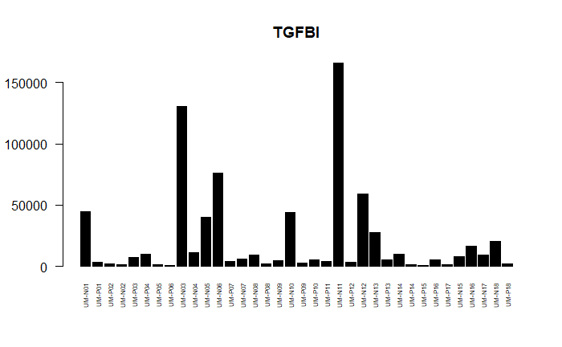
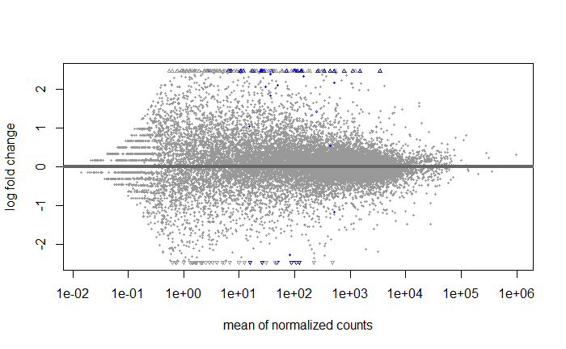
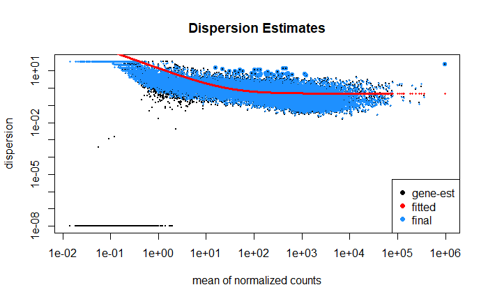

<h1>RNA Sequencing Analysis of HPV-Positive Head and Neck Cancers</h1>
## Analysis Plots

### 1. Plot Counts for Specific Genes

This plot shows the read counts for selected genes across different samples, allowing comparison of expression levels. It’s helpful for visualizing individual gene behavior and assessing variability among samples.

### 2. Volcano Plot

A volcano plot displays the log fold change versus statistical significance for all genes. Points further up and to the sides indicate genes with high significance and large expression changes, helping identify potential biomarkers or differentially expressed genes.

### 3. MA Plot

The MA plot visualizes the average expression versus the log fold change for each gene. Genes with significant differential expression appear as points away from the center. This plot is commonly used to assess the distribution and scale of changes across the dataset.

### 4. Dispersion Estimate Plot

This plot shows the dispersion estimates across genes, which are crucial for RNA-seq differential expression analysis. The plot helps evaluate the model's accuracy in fitting the data and ensures appropriate dispersion estimates for statistical tests.

<h2>Dataset Overview</h2>

<strong>Status:</strong> Public (Available since May 13, 2016) 
<strong>Title:</strong> Subtypes of HPV-positive head and neck cancers are associated with HPV characteristics, copy number variations, PIK3CA mutation, and pathway signatures. [RNA-Seq] 
<strong>Organism:</strong> Homo sapiens 
<strong>Experiment Type:</strong> Expression profiling by high throughput sequencing

<h2>Summary</h2>

This study addresses the substantial heterogeneity within HPV-positive head and neck cancer (HNC) tumors, which predisposes them to different outcomes. Using unsupervised gene expression clustering on well-annotated HPV(+) HNC samples from two cohorts (84 total primary tumors), as well as 18 HPV(-) HNCs, we identified two distinctive HPV(+) subtypes. Membership in these subtypes correlates with genic viral integration status, E2/E4/E5 expression levels, and the ratio of spliced to full-length HPV oncogene E6.

Notable differences in copy number alterations, particularly the loss of chr16q and gain of chr3q, PIK3CA mutation, and the expression of genes involved in cancer-related biological processes were observed. This characterization provides valuable molecular insights related to the alternative paths of tumor development and informs personalized care for HPV(+) HNC patients.

<h2>Overall Design</h2>

The dataset comprises <strong>36 head and neck primary tumors</strong> (18 HPV+ and 18 HPV-) and their matched blood samples, genotyped by Illumina OmniExpress SNP array. RNA-seq was performed on the same tumor samples.

<h2>Contributors</h2>
<ul>
    <li>Maureen S</li>
    <li>Laura R</li>
    <li>Yanxiao Z</li>
    <li>Anna A</li>
    <li>Tom C</li>
    <li>Douglas C</li>
    <li>Pelle H</li>
    <li>Lada K</li>
    <li>Alisha V</li>
    <li>Shama V</li>
    <li>Charles W</li>
</ul>

<h2>Citations</h2>
<ol>
    <li>Zhang Y, Koneva LA, Virani S, Arthur AE, et al. Subtypes of HPV-Positive Head and Neck Cancers Are Associated with HPV Characteristics, Copy Number Alterations, PIK3CA Mutation, and Pathway Signatures. Clin Cancer Res. 2016 Sep 15;22(18):4735-45. PMID: 27091409.</li>
    <li>Qin T, Zhang Y, Zarins KR, Jones TR, et al. Expressed HNSCC variants by HPV-status in a well-characterized Michigan cohort. Sci Rep. 2018 Jul 30;8(1):11458. PMID: 30061624.</li>
    <li>Qin T, Koneva LA, Liu Y, Zhang Y, et al. Significant association between host transcriptome-derived HPV oncogene E6* influence score and carcinogenic pathways, tumor size, and survival in head and neck cancer. Head Neck. 2020 Sep;42(9):2375-2389. PMID: 32406560.</li>
</ol>

<h2>Note</h2>

You can use your own data for similar analyses by following the methodologies outlined in this repository.

